# SilverStripe Custom Layout Page with Contact Us Form & Google Recaptcha
[](https://packagist.org/packages/alexstack/silverstripe-custom-page-with-contact-us-form)
[](https://packagist.org/packages/alexstack/silverstripe-custom-page-with-contact-us-form)
[](https://packagist.org/packages/alexstack/silverstripe-custom-page-with-contact-us-form)

- SilverStripe Custom Layout Page with Contact Us Form & flexible frontend with Google Recaptcha.

# How to install

```php
composer require alexstack/silverstripe-custom-page-with-contact-us-form
```
# Rebuild the database and flush admin page
- Run your-site-url/dev/build?flush=1 after composer install and refresh your admin page by /admin?flush=1

# How to use it
- [x] [Create a new page in SilverStripe admin and choose page type "Custom Page with Contact Us Form"](#choose-page-type)
- [x] [Choose custom page layout](#select-page-layout) from [built-in layouts](#built-in-layouts)
- [x] Or [use your own template xxx.ss](#custom-ss)
- [x] [Change Form Settings ](#form-settings), [Custom form display fields](#display-fields)
- [x] [Set up Google Recaptcha](#set-up-google-recaptcha)
- [x] [Save & publish the page](#publish-page)


# <a name="choose-page-type"></a>Create a new page in SilverStripe admin and choose page type "Custom Page with Contact Us Form"
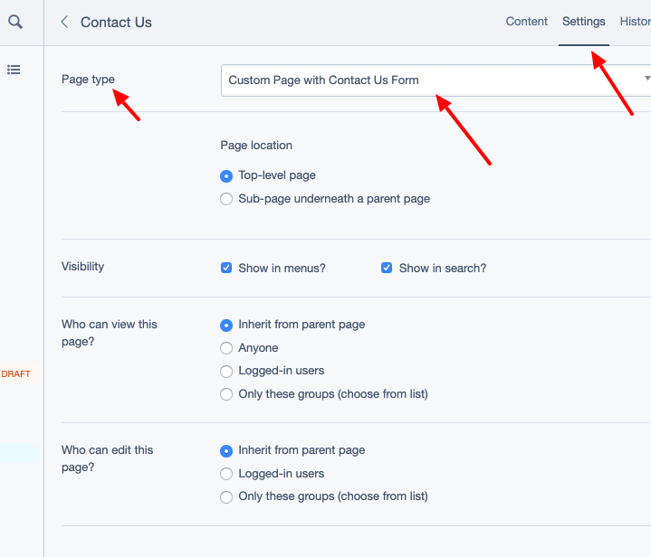

# <a name="select-page-layout"></a>Choose custom page layout
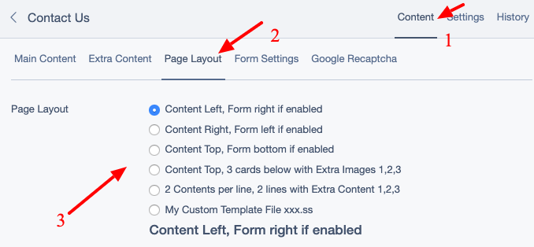

# <a name="form-settings"></a>Change Form Settings 
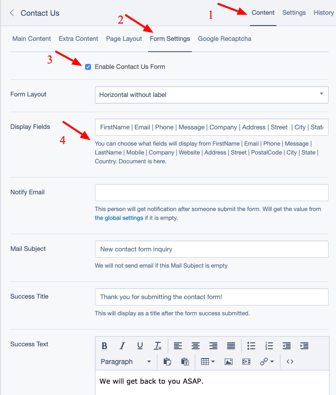

# <a name="set-up-google-recaptcha"></a>Set up Google Recaptcha
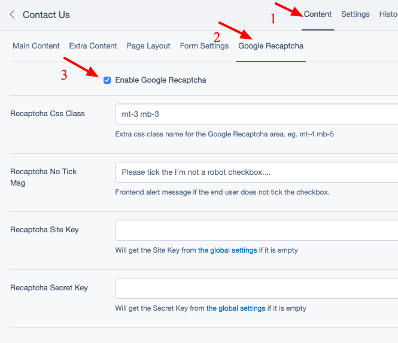

# Change global settings
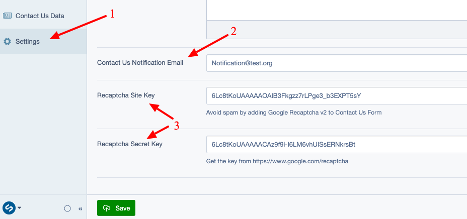

# <a name="built-in-layouts"></a>Built-in page layouts
- It will use your page.ss in your own theme folder for global layout. eg. it will use your own header/footer/css/js
- Built-in page layouts use bootstrap 4.x for grid layout
### Built-in layout 1: Content Left, Form right if enabled 
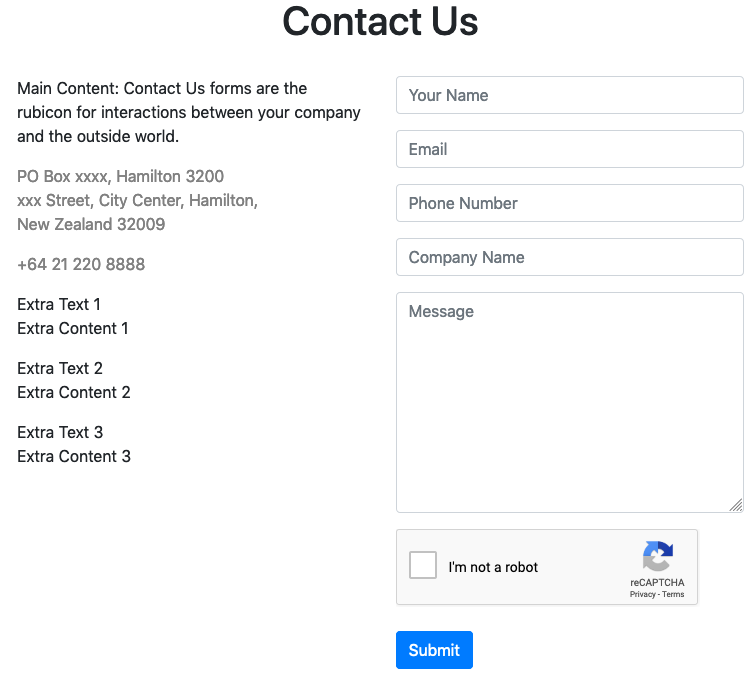
### Built-in layout 2: Content Right, Form left if enabled  
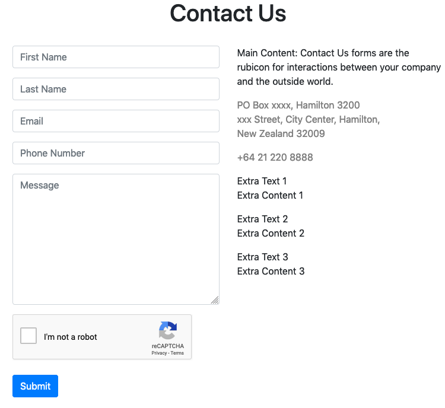
### Built-in layout 3: Content Top, Form bottom if enabled  
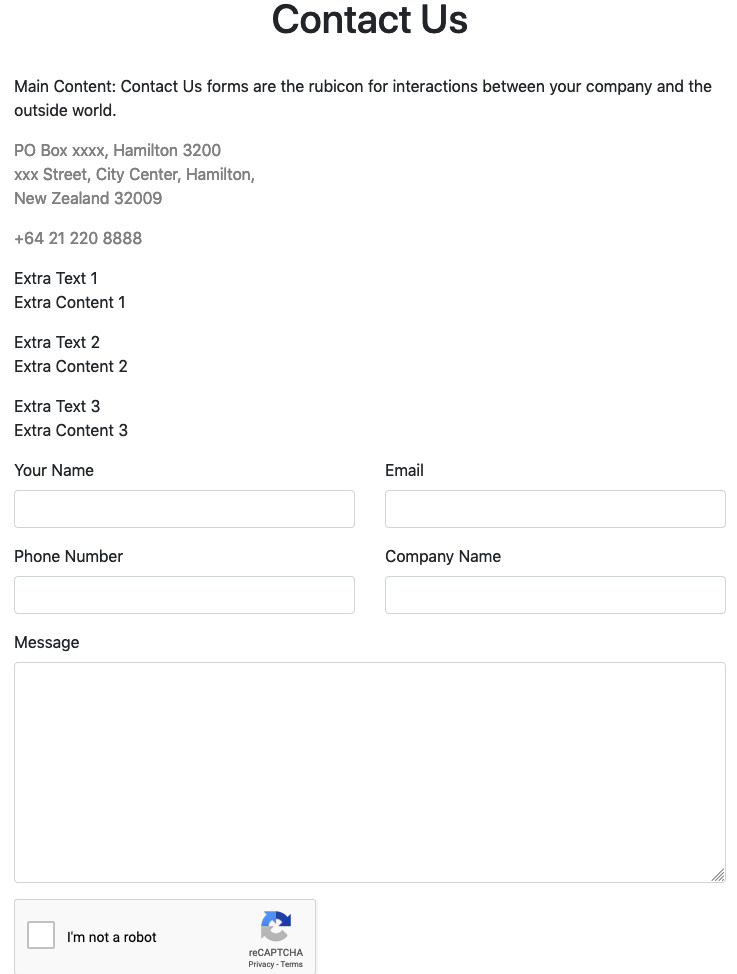
### Built-in layout 4: Content Top, 3 cards below with Extra Images 1,2,3  
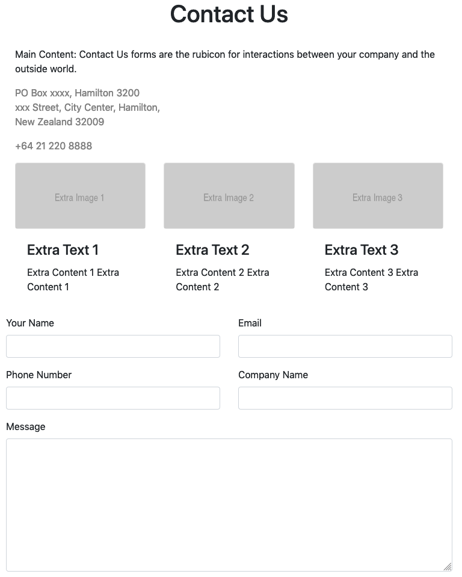
### Built-in layout 5: Two Contents per line, two lines with Extra Content 1,2,3  
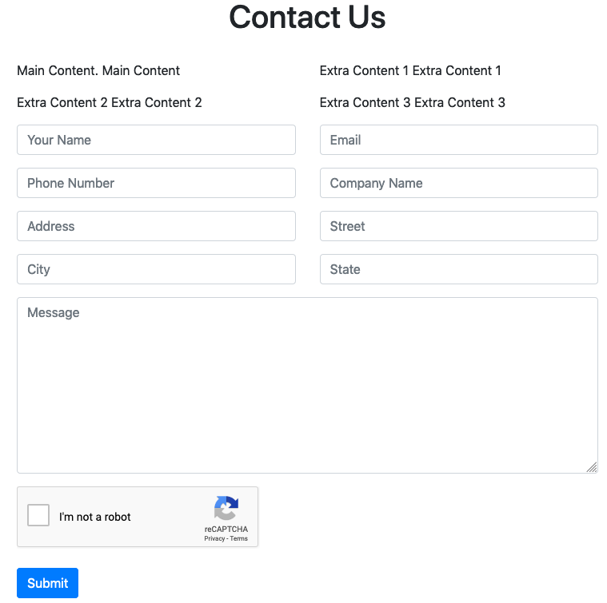

# <a name="custom-ss"></a>Use your own .ss template file for a custom page layout
- eg. NewProductPage.ss. Please make sure the template file your-theme/templates/includes/xxx.ss already exists!
- How to start the .ss: Copy vendor/alexstack/silverstripe-custom-page-with-contact-us-form/templates/Includes/CustomLayoutPage1.ss to your-theme/includes, rename it to NewProductPage.ss, change the .ss code inside to what you want. Just keep the variable names the same.
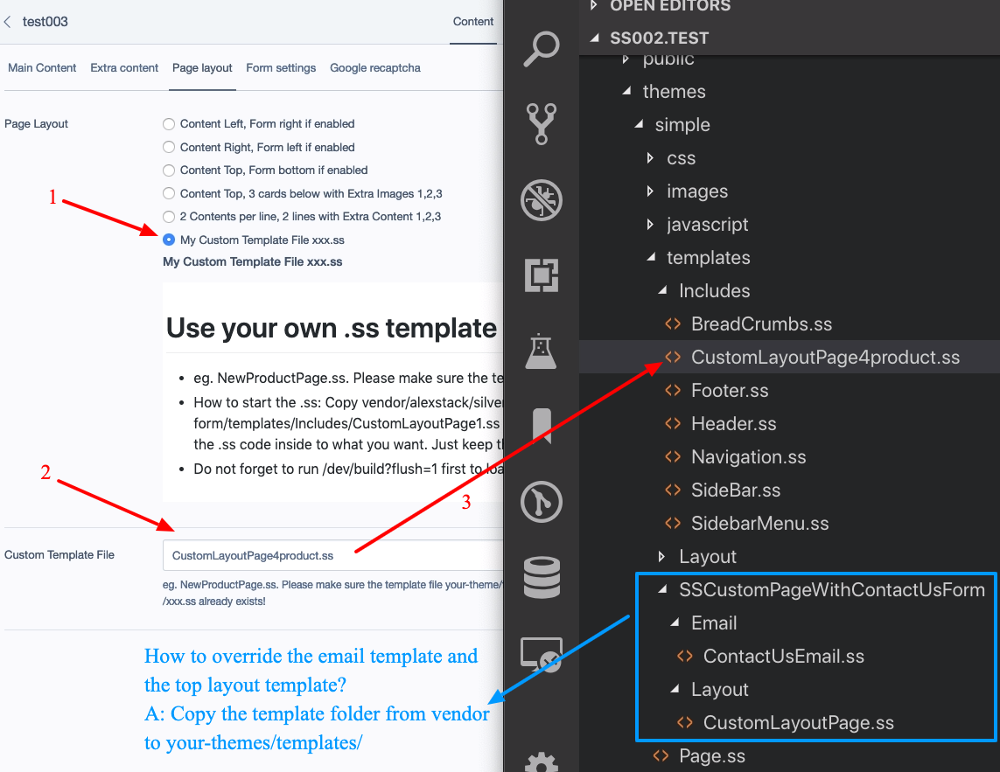
- Do not forget to run ?flush=1 first to load your new .ss template

# <a name="display-fields"></a>Contact Us Form display fields
- There are some built-in fields. You can choose what fields will display from FirstName | Email | Phone | Message | LastName | Mobile | Company | Website | Address | Street | PostalCode | City | State | Country 
- Use | for the fields separator. 
- By default, the form will display:  FirstName | Email | Phone | Company | Message
- You can easily change Company to Address by replace it with: FirstName | Email | Phone | Company | Message
- Or you can add more fields if you want.

# Override the frontend form template
- You can override the .ss template file if you want to add more fields or change fields display orders, or something else. 
- How to override: Copy vendor/alexstack/silverstripe-custom-page-with-contact-us-form/templates/Includes/ContactUsCustomForm1.ss to your-theme/includes, and add/change the html inside to what you want. Just keep the input field name the same.
- Can I add more fields to the form? You can also add some extra fields to extend the form without touch a php file or database. Available extra field names are: ExtraData1, ExtraData2, ExtraData3, ExtraData4, ExtraData5, Category, MyDate
- Override a form .ss template example screenshot:
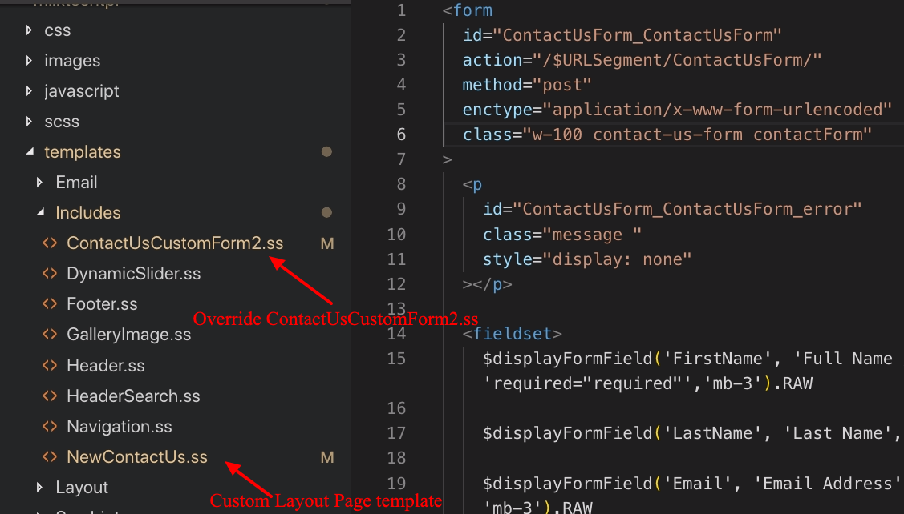

# View contact us form data
- It will send an email to the notification email address after a form submitted
- And you can view all the data in admin:
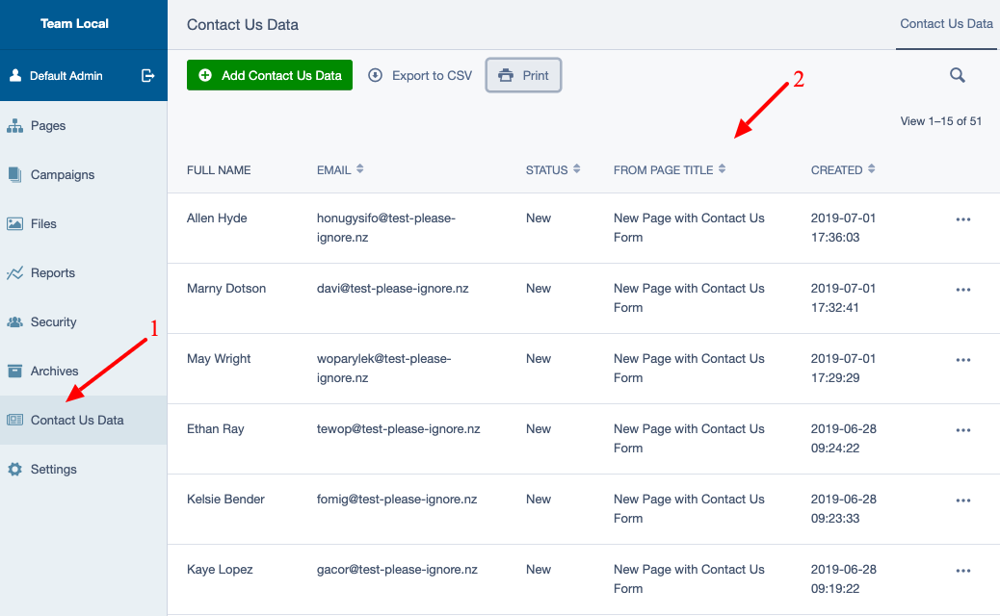

# Thanks
- Inspired by Fractaslabs' contact-page

# License
- BSD-3-Clause